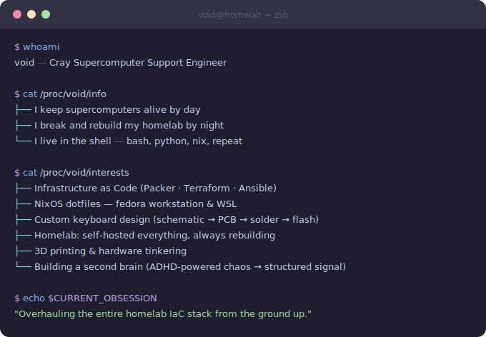

<div align="center">

<picture>
  <source media="(prefers-color-scheme: dark)" srcset="https://readme-typing-svg.demolab.com?font=JetBrains+Mono&weight=600&size=26&duration=3000&pause=800&color=CBA6F7&center=true&vCenter=true&width=520&lines=lucid-void;+%E2%86%92+%2Fhome%2Fvoid;shell+dweller+%7C+infra+architect">
  <source media="(prefers-color-scheme: light)" srcset="https://readme-typing-svg.demolab.com?font=JetBrains+Mono&weight=600&size=26&duration=3000&pause=800&color=8839ef&center=true&vCenter=true&width=520&lines=lucid-void;+%E2%86%92+%2Fhome%2Fvoid;shell+dweller+%7C+infra+architect">
  
</picture>

</div>

---

<div align="center">



</div>

---

## `~/projects`

> *"If it's not in git, it doesn't exist."*

| Project | Description | Stack | Status |
|---|---|---|---|
| 🏗️ **homelab-iac** | Full IaC homelab — Packer images, Terraform infra, Ansible provisioning, new architecture & backup philosophy | `Packer` `Terraform` `Ansible` | 🔄 Rebuilding |
| ❄️ **[dotfiles](https://github.com/lucid-void/dotfiles)** | NixOS configs for Fedora workstation & WSL — reproducible, declarative, mine | `Nix` `Zsh` | ✅ Active |
| ⌨️ **[macro32](https://github.com/lucid-void/macro32)** & **[firmware](https://github.com/lucid-void/macro32-zmk)** | 32-key macro pad built from scratch — KiCad schematic to PCB fab to firmware | `KiCad` `ZMK` `C` | 🔧 WIP |
| 🧠 **second-brain** | AI-assisted personal knowledge system — because ADHD means externalizing everything | `Python` `LLMs` | 🌱 Early |

---

## `~/stack`

**Shell & Scripting**


**Infrastructure**


**Environment**


**Hardware**


---

## `~/stats`

<div align="center">

<picture>
  <source media="(prefers-color-scheme: dark)" srcset="https://github-readme-stats.vercel.app/api?username=lucid-void&show_icons=true&hide_border=true&bg_color=1e1e2e&title_color=cba6f7&icon_color=89b4fa&text_color=cdd6f4&ring_color=cba6f7">
  <source media="(prefers-color-scheme: light)" srcset="https://github-readme-stats.vercel.app/api?username=lucid-void&show_icons=true&hide_border=true&theme=catppuccin_latte">
  
</picture>

<picture>
  <source media="(prefers-color-scheme: dark)" srcset="https://github-readme-stats.vercel.app/api/top-langs/?username=lucid-void&layout=compact&hide_border=true&bg_color=1e1e2e&title_color=cba6f7&text_color=cdd6f4&langs_count=6">
  <source media="(prefers-color-scheme: light)" srcset="https://github-readme-stats.vercel.app/api/top-langs/?username=lucid-void&layout=compact&hide_border=true&theme=catppuccin_latte&langs_count=6">
  
</picture>

</div>

<div align="center">

<picture>
  <source media="(prefers-color-scheme: dark)" srcset="https://streak-stats.demolab.com/?user=lucid-void&hide_border=true&background=1e1e2e&ring=cba6f7&fire=fab387&currStreakLabel=cdd6f4&sideLabels=cdd6f4&dates=6c7086&stroke=313244">
  <source media="(prefers-color-scheme: light)" srcset="https://streak-stats.demolab.com/?user=lucid-void&hide_border=true&theme=catppuccin-latte">
  
</picture>

</div>

---

<div align="center">

```sh
$ logout
  # flushing buffers...
  # syncing disks...
  # redirecting stdout → /dev/void
```

[](https://github.com/lucid-void)
[](https://github.com/lucid-void)

[](https://github.com/lucid-void)
[](https://github.com/lucid-void)

</div>
