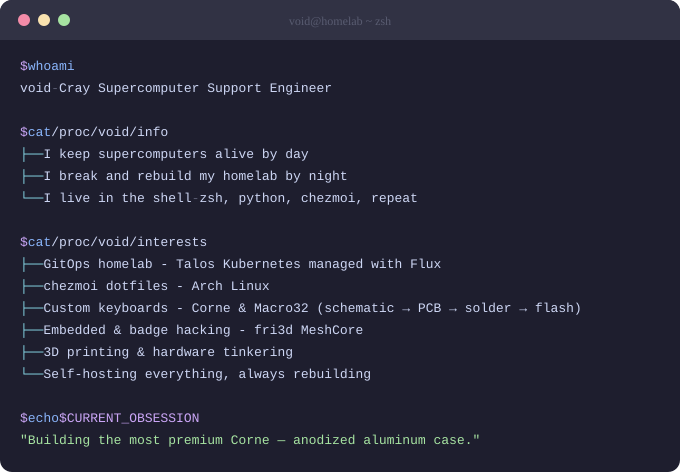

<div align="center">

<picture>
  <source media="(prefers-color-scheme: dark)" srcset="https://readme-typing-svg.demolab.com?font=JetBrains+Mono&weight=600&size=26&duration=3000&pause=800&color=CBA6F7&center=true&vCenter=true&width=520&lines=lucid-void;+%E2%86%92+%2Fhome%2Fvoid;shell+dweller+%7C+infra+architect">
  <source media="(prefers-color-scheme: light)" srcset="https://readme-typing-svg.demolab.com?font=JetBrains+Mono&weight=600&size=26&duration=3000&pause=800&color=8839ef&center=true&vCenter=true&width=520&lines=lucid-void;+%E2%86%92+%2Fhome%2Fvoid;shell+dweller+%7C+infra+architect">
  
</picture>

</div>

---

<div align="center">



</div>

---

## `~/projects`

> *"If it's not in git, it doesn't exist."*

| Project | Description | Stack | Status |
|---|---|---|---|
| 🏗️ **[homelab](https://github.com/lucid-void/homelab)** | Full IaC & GitOps homelab - Packer images, Terraform infra, Talos Kubernetes cluster managed with Flux | `Packer` `Terraform` `Talos` `Kubernetes` `Flux` `renovatebot` | 🟢 Actively running |
| 🗂️ **[dotfiles](https://github.com/lucid-void/dotfiles)** | Dotfile configs managed with chezmoi - install scripts mainly for Arch Linux | `chezmoi` `Zsh` `Arch` | ✅ Active |
| 📡 **[fri3d-meshcore](https://github.com/lucid-void/fri3d-meshcore)** | Custom MeshCore app for the Fri3d badge | `Python` `MeshCore` | ✅ Active |
| ⌨️ **[Corne](https://github.com/lucid-void/Corne)** · **[zmk-config](https://github.com/lucid-void/zmk-config)** | Wireless premium Corne with custom PCB - ZMK configs for Corne and Totem | `KiCad` `ZMK` | 🚀 In production |
| 🎮 **[Macro32](https://github.com/lucid-void/Macro32)** | Wired STM32-based custom macropad - KiCad schematic to PCB to firmware | `KiCad` `STM32` `QMK` | ✅ Active |

---

## `~/stack`

**Shell & Scripting**

<picture><source media="(prefers-color-scheme: dark)" srcset="https://img.shields.io/badge/zsh-1e1e2e?style=for-the-badge&logo=gnubash&logoColor=a6e3a1"><source media="(prefers-color-scheme: light)" srcset="https://img.shields.io/badge/zsh-eff1f5?style=for-the-badge&logo=gnubash&logoColor=40a02b"></picture>
<picture><source media="(prefers-color-scheme: dark)" srcset="https://img.shields.io/badge/Python-1e1e2e?style=for-the-badge&logo=python&logoColor=f9e2af"><source media="(prefers-color-scheme: light)" srcset="https://img.shields.io/badge/Python-eff1f5?style=for-the-badge&logo=python&logoColor=df8e1d"></picture>

**Infrastructure**

<picture><source media="(prefers-color-scheme: dark)" srcset="https://img.shields.io/badge/Terraform-1e1e2e?style=for-the-badge&logo=terraform&logoColor=cba6f7"><source media="(prefers-color-scheme: light)" srcset="https://img.shields.io/badge/Terraform-eff1f5?style=for-the-badge&logo=terraform&logoColor=8839ef"></picture>
<picture><source media="(prefers-color-scheme: dark)" srcset="https://img.shields.io/badge/Ansible-1e1e2e?style=for-the-badge&logo=ansible&logoColor=f38ba8"><source media="(prefers-color-scheme: light)" srcset="https://img.shields.io/badge/Ansible-eff1f5?style=for-the-badge&logo=ansible&logoColor=d20f39"></picture>
<picture><source media="(prefers-color-scheme: dark)" srcset="https://img.shields.io/badge/Packer-1e1e2e?style=for-the-badge&logo=packer&logoColor=89dceb"><source media="(prefers-color-scheme: light)" srcset="https://img.shields.io/badge/Packer-eff1f5?style=for-the-badge&logo=packer&logoColor=04a5e5"></picture>
<picture><source media="(prefers-color-scheme: dark)" srcset="https://img.shields.io/badge/Kubernetes-1e1e2e?style=for-the-badge&logo=kubernetes&logoColor=89b4fa"><source media="(prefers-color-scheme: light)" srcset="https://img.shields.io/badge/Kubernetes-eff1f5?style=for-the-badge&logo=kubernetes&logoColor=1e66f5"></picture>
<picture><source media="(prefers-color-scheme: dark)" srcset="https://img.shields.io/badge/Flux-1e1e2e?style=for-the-badge&logo=flux&logoColor=a6e3a1"><source media="(prefers-color-scheme: light)" srcset="https://img.shields.io/badge/Flux-eff1f5?style=for-the-badge&logo=flux&logoColor=40a02b"></picture>

**Environment**

<picture><source media="(prefers-color-scheme: dark)" srcset="https://img.shields.io/badge/Arch_Linux-1e1e2e?style=for-the-badge&logo=archlinux&logoColor=89b4fa"><source media="(prefers-color-scheme: light)" srcset="https://img.shields.io/badge/Arch_Linux-eff1f5?style=for-the-badge&logo=archlinux&logoColor=1793d1"></picture>
<picture><source media="(prefers-color-scheme: dark)" srcset="https://img.shields.io/badge/Linux-1e1e2e?style=for-the-badge&logo=linux&logoColor=f9e2af"><source media="(prefers-color-scheme: light)" srcset="https://img.shields.io/badge/Linux-eff1f5?style=for-the-badge&logo=linux&logoColor=df8e1d"></picture>
<picture><source media="(prefers-color-scheme: dark)" srcset="https://img.shields.io/badge/Git-1e1e2e?style=for-the-badge&logo=git&logoColor=fab387"><source media="(prefers-color-scheme: light)" srcset="https://img.shields.io/badge/Git-eff1f5?style=for-the-badge&logo=git&logoColor=fe640b"></picture>

**Hardware**

<picture><source media="(prefers-color-scheme: dark)" srcset="https://img.shields.io/badge/KiCad-1e1e2e?style=for-the-badge&logo=kicad&logoColor=fab387"><source media="(prefers-color-scheme: light)" srcset="https://img.shields.io/badge/KiCad-eff1f5?style=for-the-badge&logo=kicad&logoColor=fe640b"></picture>
<picture><source media="(prefers-color-scheme: dark)" srcset="https://img.shields.io/badge/QMK_Firmware-1e1e2e?style=for-the-badge&logo=qmk&logoColor=cba6f7"><source media="(prefers-color-scheme: light)" srcset="https://img.shields.io/badge/QMK_Firmware-eff1f5?style=for-the-badge&logo=qmk&logoColor=8839ef"></picture>
<picture><source media="(prefers-color-scheme: dark)" srcset="https://img.shields.io/badge/ZMK_Firmware-1e1e2e?style=for-the-badge&logo=qmk&logoColor=a6e3a1"><source media="(prefers-color-scheme: light)" srcset="https://img.shields.io/badge/ZMK_Firmware-eff1f5?style=for-the-badge&logo=qmk&logoColor=40a02b"></picture>

---

## `~/stats`

<div align="center">

<picture>
  <source media="(prefers-color-scheme: dark)" srcset="https://github-readme-stats.vercel.app/api?username=lucid-void&show_icons=true&hide_border=true&bg_color=1e1e2e&title_color=cba6f7&icon_color=89b4fa&text_color=cdd6f4&ring_color=cba6f7&cache_seconds=86400">
  <source media="(prefers-color-scheme: light)" srcset="https://github-readme-stats.vercel.app/api?username=lucid-void&show_icons=true&hide_border=true&bg_color=eff1f5&title_color=8839ef&icon_color=1e66f5&text_color=4c4f69&ring_color=8839ef&cache_seconds=86400">
  
</picture>

<picture>
  <source media="(prefers-color-scheme: dark)" srcset="https://github-readme-stats.vercel.app/api/top-langs/?username=lucid-void&layout=compact&hide_border=true&bg_color=1e1e2e&title_color=cba6f7&text_color=cdd6f4&langs_count=6&cache_seconds=86400">
  <source media="(prefers-color-scheme: light)" srcset="https://github-readme-stats.vercel.app/api/top-langs/?username=lucid-void&layout=compact&hide_border=true&bg_color=eff1f5&title_color=8839ef&text_color=4c4f69&langs_count=6&cache_seconds=86400">
  
</picture>

</div>

<div align="center">

<picture>
  <source media="(prefers-color-scheme: dark)" srcset="https://streak-stats.demolab.com/?user=lucid-void&hide_border=true&background=1e1e2e&ring=cba6f7&fire=fab387&currStreakLabel=cdd6f4&sideLabels=cdd6f4&dates=6c7086&stroke=313244">
  <source media="(prefers-color-scheme: light)" srcset="https://streak-stats.demolab.com/?user=lucid-void&hide_border=true&background=eff1f5&ring=8839ef&fire=fe640b&currStreakLabel=4c4f69&sideLabels=4c4f69&dates=9ca0b0&stroke=ccd0da">
  
</picture>

</div>

---

<div align="center">

```sh
$ logout
  # flushing buffers...
  # syncing disks...
  # redirecting stdout → /dev/void
```

<picture><source media="(prefers-color-scheme: dark)" srcset="https://img.shields.io/github/followers/lucid-void?style=for-the-badge&logo=github&labelColor=1e1e2e&color=cba6f7&logoColor=cdd6f4"><source media="(prefers-color-scheme: light)" srcset="https://img.shields.io/github/followers/lucid-void?style=for-the-badge&logo=github&labelColor=eff1f5&color=8839ef&logoColor=4c4f69"><a href="https://github.com/lucid-void"></a></picture>
<picture><source media="(prefers-color-scheme: dark)" srcset="https://komarev.com/ghpvc/?username=lucid-void&style=for-the-badge&color=cba6f7&labelColor=1e1e2e"><source media="(prefers-color-scheme: light)" srcset="https://komarev.com/ghpvc/?username=lucid-void&style=for-the-badge&color=8839ef&labelColor=eff1f5"><a href="https://github.com/lucid-void"></a></picture>

</div>
